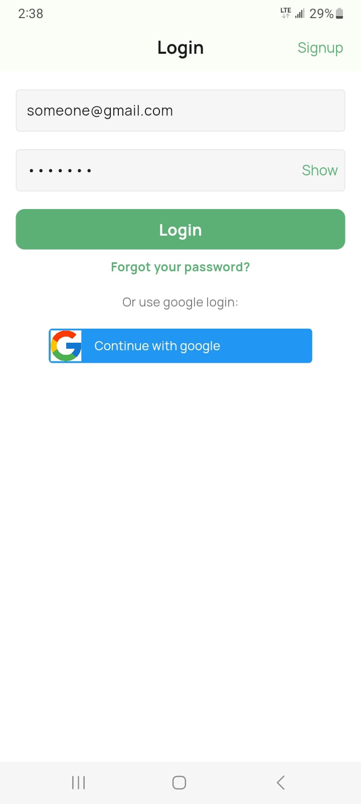
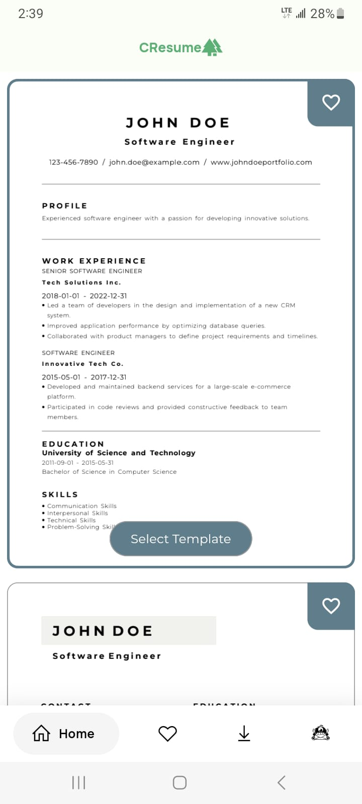
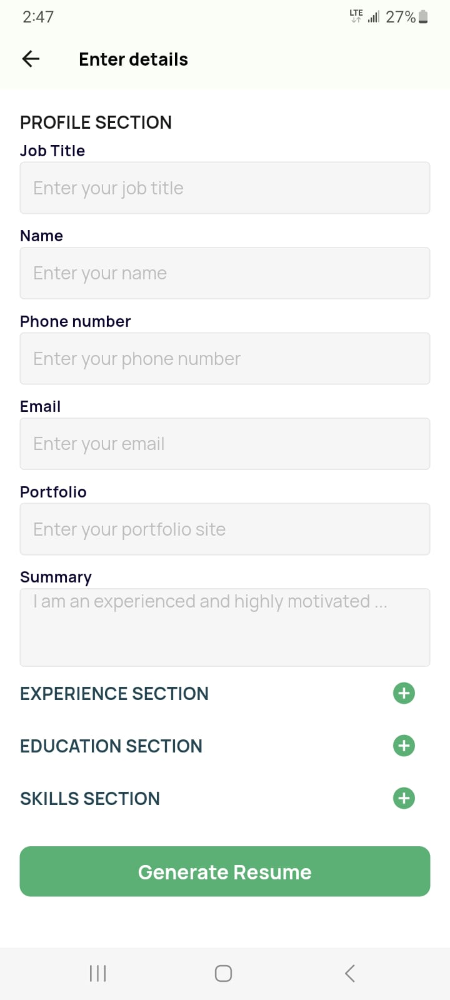
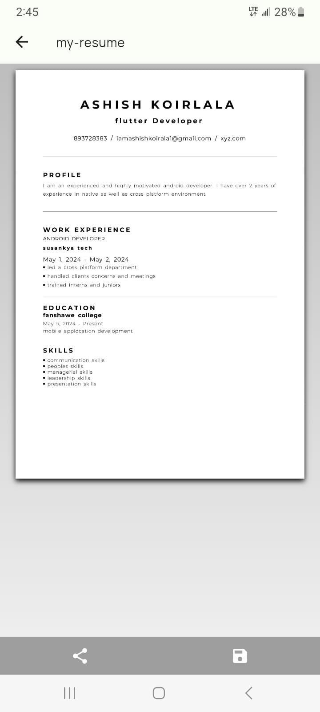
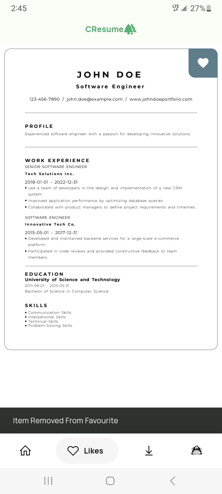
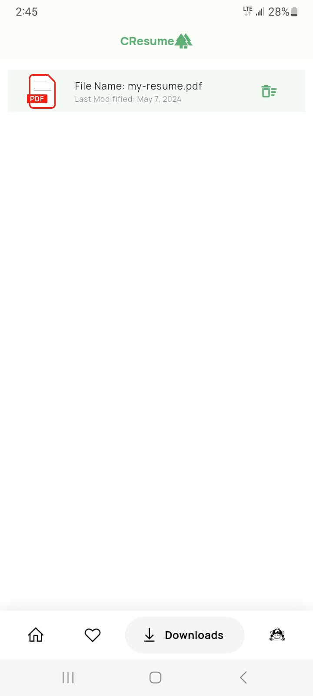

## Welcome to my Resume Builder application built using Flutter! This Readme will guide you through the features, setup, and usage of our application.

  

## Key features

- Authentication using google account
- Pdf generation
- Pdf Share feature directly from the app
- Download feature

## To run the Resume Builder application on your local machine, follow these steps:

- Install Flutter:
- Clone the Repository:
- Navigate to the Project Directory:
- Get Dependencies:
- Run the Application:

## Usage:

- Launch the application
- Login/ Signup to start creating new resume
- Choose from a variety of sample resumes
- Fill a form mentioning all the details about you
- Click generate pdf
- Name your generated pdf
- You can choose to share or download the generated resume
- Check for your downloaded resume on downloads page
